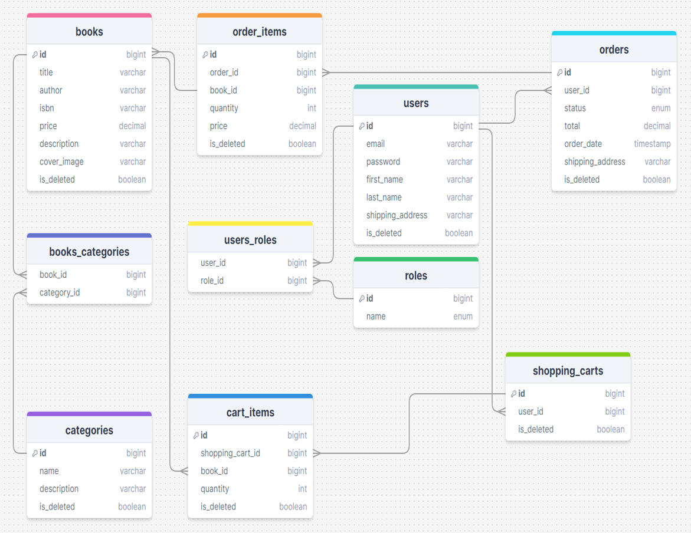

📚 The "Book Store" project is an online platform for book enthusiasts. Users have the ability to browse a wide range of books across various genres, explore their descriptions, learn about authors, and discover prices.

The service offers a convenient search for books by categories to provide quick access to literary works. Each user can create a personal account, track purchase history. Adding books to the cart and completing orders is done easily and efficiently, providing customers with a convenient and secure way to purchase their selected literature.

## Technologies Used

- **Java**: Programming language used as the foundation for the project.
- **Spring Boot**: Framework for building robust Java applications.
- **Spring Security**: Provides authentication and authorization capabilities.
- **JWT**: (JSON Web Token) Standard for securely transmitting information between parties as a JSON object.
- **Spring Data JPA**: Simplifies the data access layer by abstracting away the boilerplate code.
- **Mapstruct**: Used for mapping between DTOs and entities.
- **Lombok**: Library for reducing boilerplate code in Java classes.
- **Maven**: Build automation tool used for managing dependencies and building the project.
- **Liquibase**: Manages database schema changes over time.
- **Jackson**: Provides JSON serialization and deserialization capabilities in Java.
- **Swagger**: Generates interactive API documentation.
- **MySQL**: Database for storing application data.
- **Docker**: For containerizing the application.
- **JUnit 5**: Framework for unit testing.
- **Mockito**: Framework for mocking objects in tests.

## Inside the Book Store

The project is structured using Layered Architecture, providing a clear separation of concerns with distinct levels. Each level is responsible for specific aspects of functionality, ensuring a well-organized and modularized design.

1. **Controller Layer:**
   Responsible for handling HTTP requests and interacting with clients. Controllers contain logic to process requests and invoke corresponding services.

2. **Service Layer:**
   Implements the business logic of the application. Services interact with repositories and mappers for data processing and storage.

3. **Repository Layer:**
   Handles interactions with the database. Repositories are responsible for retrieving and storing data in accordance with the business logic.

4. **Security Layer:**
   Manages authentication and authorization, securing access to protected resources through role-based access control (e.g., USER and ADMIN roles).

5. **DTO (Data Transfer Object) Layer:**
   Contains objects used for data transfer between levels, optimizing data exchange and eliminating unnecessary information in responses.

6. **Mapper Layer:**
   Utilized for converting objects between entities and Data Transfer Objects (DTOs).

7. **Test:**
   Includes tests to verify the correctness of various parts of the application, including controllers, services, and repositories.

Entities include:
- **Book:** Represents a book with details such as title, author, and other characteristics.
- **Category:** Used for classifying books into categories.
- **Shopping Cart:** Contains information about items added to a user's shopping cart.
- **Cart Item:** Represents an item in the cart with a link to a specific book.
- **User:** Represents a user with account details and roles.
- **Role:** Defines user roles (e.g., USER and ADMIN).
- **Order:** Stores information about orders, including purchase details and other attributes.
- **Order Item:** Links books to a specific order and stores the quantity of purchased copies.
Below, you'll find detailed explanations for each endpoint in the Postman collection, helping you navigate and understand the functionalities of the Bookstore API more effectively.

## Access to endpoints
🟩 - publicly available  
🟨 - for logged-in users  
🟥 - for administrators

### User Management

- 🟩 `POST: /api/auth/registration` - **User Registration**: New customers can register with their email, password, and personal details.
- 🟩 `POST: /api/auth/login` - **User Authentication**: Secure login mechanism for registered users.

### Book Management

- 🟨 `GET: /api/books` - **Retrieve Book Catalog**: Users can browse the catalog of available books.
- 🟨 `GET: /api/books/{id}` - **View Book Details**: Users can also check information about each book individually.
- 🟨 `GET: /api/books/search` - **Search Books**: Users can search for books based on various parameters.
- 🟥 `POST: /api/books` - **Add New Book**: Admin users can add new books to the catalog.
- 🟥 `PUT: /api/books/{id}` - **Update Book Details**: Admin users can update existing book details.
- 🟥 `DELETE: /api/books/{id}` - **Delete Book**: Admin users can remove books from the catalog.

### Category Management

- 🟨 `GET: /api/categories` - **Retrieve Categories**: Users can view the list of available categories.
- 🟨 `GET: /api/categories/{id}` - **View Category**: Users can also check information about each category individually.
- 🟨 `GET: /api/categories/{id}/books` - **Get Books by Category**: Users can retrieve all books belonging to a specific category.
- 🟥 `POST: /api/categories` - **Create Category**: Admin users can create new categories for books.
- 🟥 `PUT: /api/categories/{id}` - **Update Category**: Admin users can update category details.
- 🟥 `DELETE: /api/categories/{id}` - **Delete Category**: Admin users can delete categories.

### Shopping Cart

- 🟨 `GET: /api/cart` - **View Cart**: Users can view the contents of their shopping cart.
- 🟨 `POST: /api/cart` - **Add to Cart**: Users can add books to their shopping cart.
- 🟨 `PUT: /api/cart/cart-items/{id}` - **Update Cart**: Users can update the quantity of a specific item in their cart.
- 🟨 `DELETE: /api/cart/cart-items/{id}` - **Remove from Cart**: Users can remove a specific item from their cart.

### Order Management

- 🟨 `GET: /api/orders` - **View Orders History**: Users can view all their orders history.
- 🟨 `GET: /api/orders/{id}/items` - **View Order Items**: Users can view all items included in a specific order.
- 🟨 `GET: /api/orders/{orderId}/items/{itemId}` - **View Specific Order Item**: Users can check details of a particular item within an order.
- 🟨 `POST: /api/orders` - **Place Order**: Users can place orders for the books in their cart.
- 🟥 `PATCH: /api/orders/{id}` - **Update Order Status**: Admin users can update the status of orders.

## SQL Database Diagram
Below is a representation of the database used in the project:



## Video Presentation
CORRECT THE VIDEO!!!!!!!!!!!!!!!!!!!!!!!!!!!!!!!!!!!!!!!!!!!!!!!!!!!!!!
For a visual demonstration of how the Bookstore API works and its various functionalities, you can watch the video presentation available [here](https://www.loom.com/share/).

## How to run Book Store API
1. Download and install [Docker](https://www.docker.com/products/docker-desktop/), [Maven](https://maven.apache.org/download.cgi), [JDK Development Kit](https://www.oracle.com/pl/java/technologies/downloads/)
2. Clone the project [git repository](https://github.com/QbaSekowski/spring-book-app.git)
3. In the .env file you should provide necessary DB and Docker variables, here is an example:
```mysql
MYSQLDB_USER=root  
MYSQLDB_ROOT_PASSWORD=root  
MYSQLDB_DATABASE=test_db  
MYSQLDB_LOCAL_PORT=3307  
MYSQLDB_DOCKER_PORT=3306  
SPRING_LOCAL_PORT=8088  
SPRING_DOCKER_PORT=8080  
DEBUG_PORT=5005
```
4. Run the command `mvn clean package`
5. Use `docker-compose build` to build Docker container.
6. Use `docker-compose up` to run Docker container.
7. Access the locally running application at http://localhost:8088/api
8. To stop and remove containers use `docker-compose down`

## Possible Improvement

### Payment Integration
Incorporating a payment system, likely utilizing the Stripe API, to enable secure and convenient online payments. This will allow users to effortlessly complete their orders and make purchases directly within the application.

## Final thoughts

This is my first big java project, I encountered a few difficulties while working on it. Some of which I was able to deal with fairly quickly, but some of which were more difficult. Solving the most difficult problems was what satisfied me the most. The issues I encountered allowed me to develop the ability to effectively search for solutions, using the information in the available documentation. Thanks to the knowledge I gained, I know that the future obstacles in my path I will be able to overcome quicker.